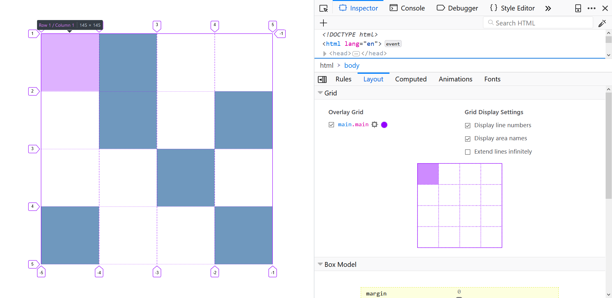

## Intro

CSS _[Grid](https://www.mozilla.org/en-US/developer/css-grid/)_ i _[Flexbox](https://css-tricks.com/snippets/css/a-guide-to-flexbox/)_ sadašnjost su i budućnost efikasnog i robustnog raspoređivanja HTML elemenata na vašim web stranicama.

> **CSS Grid Inspector by Mozilla**  
> Mozillin _[CSS Grid Inspector](https://developer.mozilla.org/en-US/docs/Tools/Page_Inspector/How_to/Examine_grid_layouts)_ značajno će vam olakšati rad s CSS Gridom. Ovaj alat dio je _Firefox_-ovog _DevTools_-a, a omogućava jednostavan pregled kreiranog _grid_-a, debugiranje eventualnih problema u rasporedu elemenata, i druge korisne stvari pri radu s _grid_-om (vidi sliku u nastavku).

## Reference

- [Grid by Example by Rachel Andrew](https://gridbyexample.com)
- [Learn CSS Grid](https://learncssgrid.com/)
- [A Complete Guide to Flexbox by CSS-TRICKS](https://css-tricks.com/snippets/css/a-guide-to-flexbox/)
- [A Complete Guide to Grid by CSS-TRICKS](https://css-tricks.com/snippets/css/complete-guide-grid/)